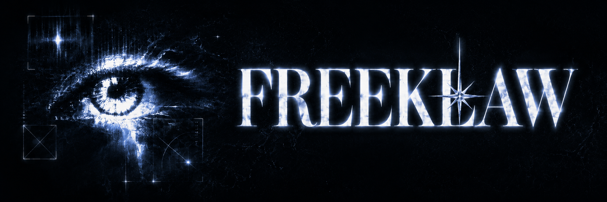

<p align="center">
  
</p>

<h1 align="center">Freeklaw</h1>

<p align="center">
  <strong>Text your Hermes agent a job link. It applies from your Mac.</strong>
</p>

<p align="center">
  <a href="LICENSE"></a>
  
  
  
</p>

<p align="center">
  <a href="#quick-start">Quick start</a> ·
  <a href="#how-it-works">How it works</a> ·
  <a href="docs/RISK-REGISTER.md">Risk register</a> ·
  <a href="docs/IMPLEMENTATION-PLAN.md">Implementation plan</a>
</p>

---

Freeklaw is an open-source, local-first skill pack for job applications. It does not run a hosted service or replace your agent. Your existing [Hermes Agent](https://github.com/NousResearch/hermes-agent) installation does the reasoning, [Photon](https://photon.codes) carries iMessages, and [ego lite](https://lite.ego.app) drives the browser.

> [!WARNING]
> **Freeklaw is experimental alpha software.** It accepts links from any job site on a best-effort basis. Captchas, 2FA, unusual controls, site policy, or unsafe page behavior can stop a run. Auto-submit and automated credential use are not hardened against a malicious page. Read the [risk register](docs/RISK-REGISTER.md) before enabling them.

## How it works

```text
You send a job link
        │
        ▼
Photon delivers it to Hermes
        │
        ▼
Freeklaw reads your local profile
        │
        ▼
ego lite completes the application in your browser
        │
        ▼
You approve submission by default
```

| Local-first | Human-aware | Honest by design |
| --- | --- | --- |
| Your profile, checkpoint, and minimal history stay under `~/.freeklaw/`. | Login, captcha, 2FA, and final submission can pause for you. | Missing answers are requested, never invented. Blocked runs report the blocker. |

Freeklaw deliberately does **not** include its own agent runtime, model configuration, message queue, command language, job discovery service, or resume generator.

## What is included

| Component | Purpose |
| --- | --- |
| `freeklaw-onboarding` | Interviews you locally and writes a private `~/.freeklaw/profile.yaml`. |
| `freeklaw` | Uses your profile and existing resume PDF to complete a job application through ego lite. |
| `install.sh` | Checks or installs tested dependencies, guides required GUI setup, and installs both skills through Hermes. |
| Local helpers | Validate profiles, manage safe checkpoints, detect duplicates, retain minimal history, and fill credentials without printing secrets. |

## Requirements

- macOS on Apple Silicon or Intel
- A model/provider already working in Hermes
- A Photon account and a phone that can activate its assigned iMessage line
- Brief access to the Mac GUI for ego lite onboarding, login/captcha handoffs, and approvals
- An existing PDF resume

The installer uses four upstream components: [Hermes Agent](https://github.com/NousResearch/hermes-agent), [Photon](https://photon.codes), [ego lite](https://lite.ego.app), and [agent-vault](https://github.com/botiverse/agent-vault) for local credential references.

## Quick start

### Fastest: send this link to your agent

Copy the link below and send it to any capable AI agent on your Mac (Hermes, Claude, Cursor, …). It contains agent-readable instructions to install Freeklaw from the pinned release and hand you off to onboarding:

```text
https://raw.githubusercontent.com/Jacky040124/freeklaw/v0.1.0-alpha.2/AGENT-INSTALL.md
```

Or install manually:

### 1. Download a release

Download a [tagged Freeklaw release](https://github.com/Jacky040124/freeklaw/releases) and inspect it before running anything.

### 2. Check your Mac

```bash
./install.sh --check
```

This is read-only. It reports which tested dependencies are ready, missing, or incompatible.

### 3. Install

```bash
./install.sh
```

A normal install reuses compatible dependencies and installs only what is missing. If it finds a dependency outside the tested compatibility set, it stops without changing it. Review the message and use `./install.sh --upgrade` only when you intend to replace or update that dependency.

The installer never chooses a Hermes model, creates a Hermes profile, or edits Hermes conversation settings. It uses your active Hermes profile and official setup flows.

> [!NOTE]
> Ego lite requires one GUI onboarding step. Photon requires browser authorization and an activation text from your phone. The installer prints the exact next action at each boundary; run `./install.sh --check` again when setup is complete.

## Use

Start Hermes locally and ask it to set up Freeklaw. The onboarding skill collects application facts, validates the absolute path to your resume PDF, and asks how submissions should work:

- **`approve_each`** — the default; pauses immediately before final submission.
- **`auto_submit`** — opt-in; requires explicit acknowledgement of the experimental security risk.

Credential automation has separate consent. The default is a browser handoff, where you type or approve the login yourself. Optional **`approve_each_fill`** requires your approval before every vault-backed fill, and **`auto_fill`** lets the vault bridge fill logins on the employer's application flow without per-fill approval. A separate **`auto_create_accounts`** opt-in lets Freeklaw register applicant accounts automatically — a local helper generates each password directly into agent-vault, so the agent never sees it. Every non-default mode requires its own explicit risk acknowledgement.

After onboarding, send Hermes a job link through its normal conversation surface. With Photon configured, that can be iMessage. You can talk to Hermes normally for status, cancellation, or settings changes; Freeklaw adds no special command language.

Freeklaw never invents factual answers. If your profile does not contain an answer, it asks you and saves the answer only after you confirm.

## Privacy and local data

Freeklaw keeps owner-only files under `~/.freeklaw/`:

- your profile;
- at most one active application checkpoint;
- minimal outcome history for status and duplicate warnings.

History excludes credentials, page HTML, screenshots, and full conversations. Employer passwords are not stored in the profile. New secrets are entered by you through agent-vault's local terminal flow.

## Honest constraints

- **Inference is not free.** Freeklaw's code is free, but your Hermes model/provider may charge for long browser sessions.
- **The Mac must be available.** A sleeping or logged-out Mac cannot run the agent or browser.
- **Any-site support is best effort.** Freeklaw reports a blocker instead of claiming universal completion.
- **Some steps remain manual.** Captcha, 2FA, browser login approval, and some native dialogs require control of the Mac.
- **Ego lite is a hard dependency.** It is free but closed-source, and its current download endpoint is not versioned.
- **This is experimental security software.** A skill prompt and agent-vault are not an operating-system sandbox around a shell-capable agent processing untrusted pages.
- **You are the operator.** Employer and job-board terms remain yours to follow. Freeklaw never attempts captcha solving or anti-bot evasion.

## Development

Run the local checks:

```bash
uv run --with pytest --with pyyaml pytest -q
sh tests/test_install.sh
```

Before publishing a tag, validate both `SKILL.md` files with an Agent Skills validator and run Hermes `skills inspect` against the immutable tagged URLs.

The [implementation plan](docs/IMPLEMENTATION-PLAN.md) defines the alpha boundary. The [risk register](docs/RISK-REGISTER.md) records accepted risks and remaining release evidence.

## License

Freeklaw is available under the [MIT License](LICENSE).
